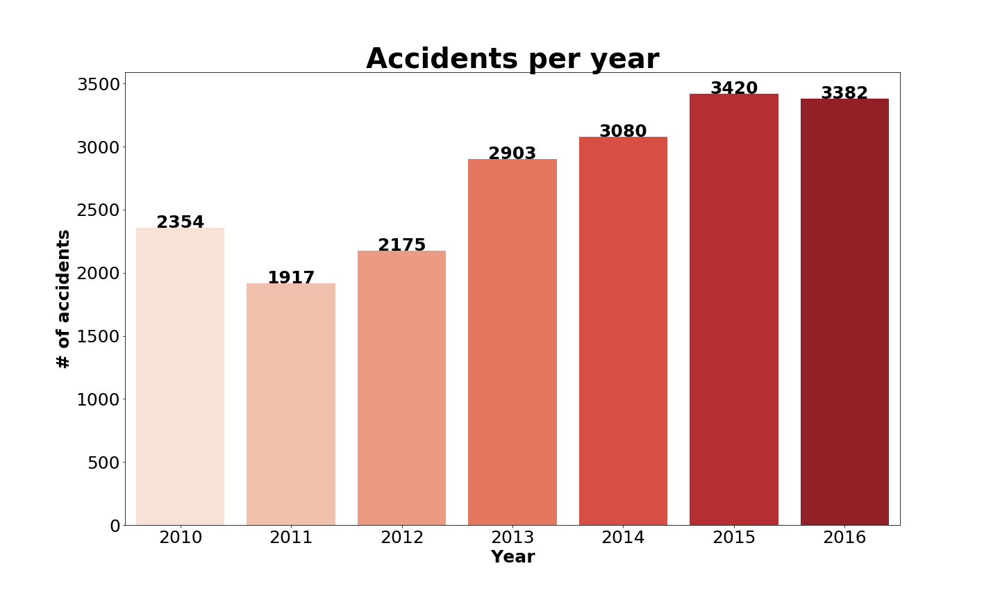
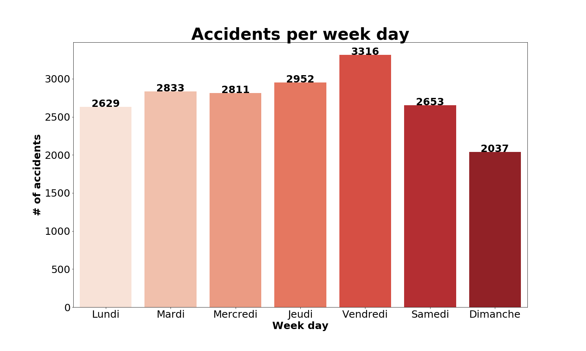
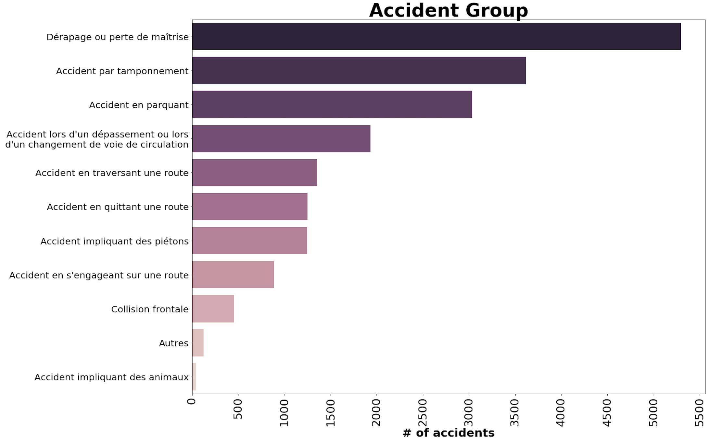
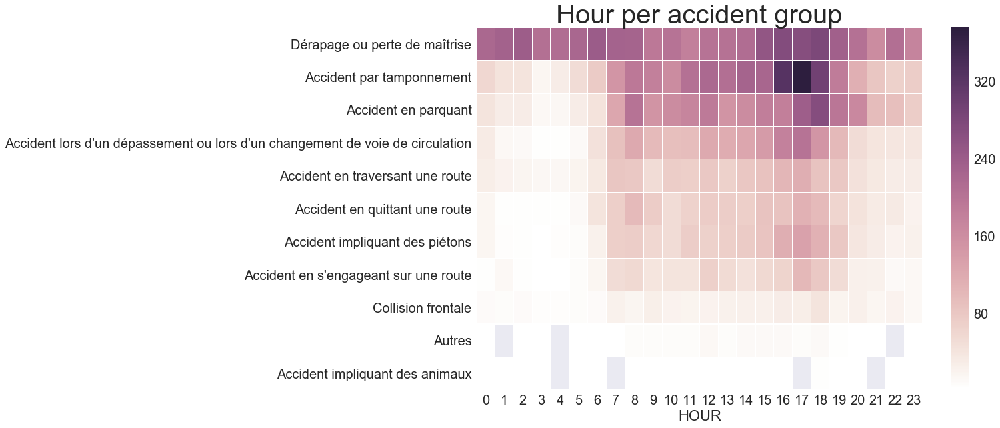
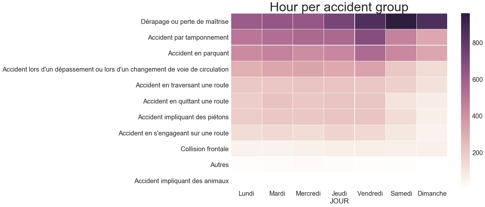
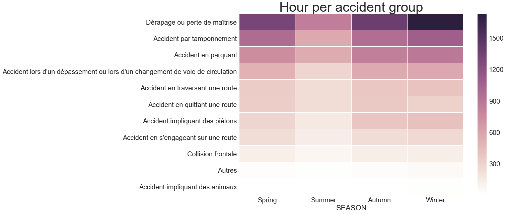
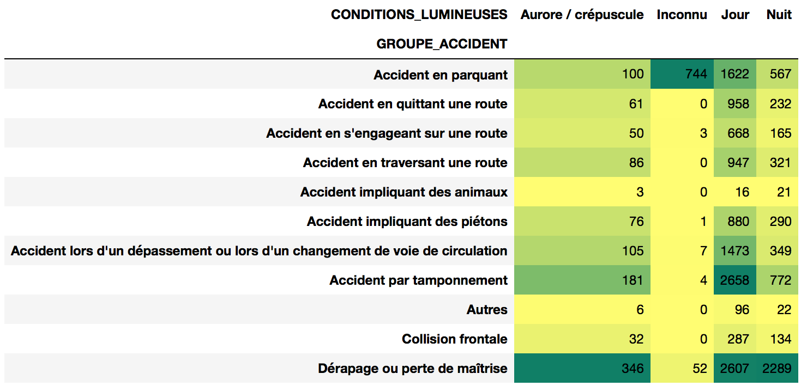
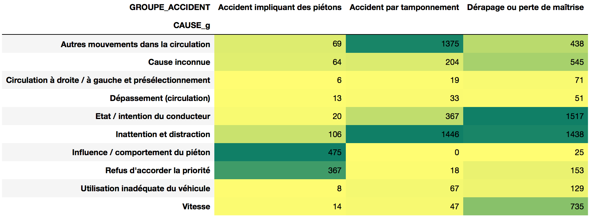
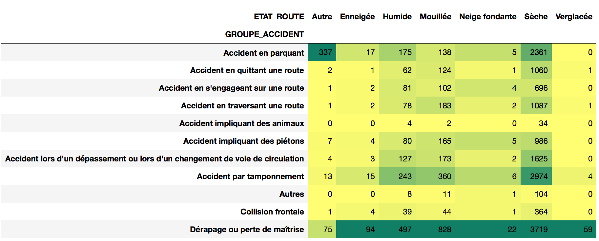

Road safety has always a been a first in the list matter for administration. An exploratory analysis has been done in order to understand better and get a general overviewof the Geneva accidents

 
 

## When does the accidents happen?
All the news evoque to an increase of accidents during last years. The evolution of number of accidents from 2010 to 2016 in Geneva shows that from 2012 to 2014 there has been a **strong increase**, however it has been stabilized during the last two years.

> ### In 2015, there were 66 accidents per week

The **months of the year with more accidents** are March, June, September and October. This coincide with the holidays start or the holidays ending. It can also be observed that in average, there are **more accidents at the end of the year**.

But when is the day of the week with more number of accidents in average? From Monday to Thursday we observe that there is the same amount of accidents in average. Let's check which day of the week there are more accidents:

> ### **Be careful** on Friday!
## Is there the same risk during the morning and the evening?
It is known that the traffic is more dense in the morning or in the afternoon, when people go or come back home. We observe that it also correlated with the number of accidents.
> ### The time of the day you may be more aware is at 17h

 
 
 
 

## Which are the more recurrent type of accident and when?
> ### Drift, Traffic jam collision and Parking accidents are the accident group with more ocurrence.

The number of accidents during the day is larger than during the night. However, the number of **drifting accidents** is nearly the same during the day than during the night. In addition, it is observed on the data that **speed is one of the main causes of the accidents at night**.

#### Accidents per day hour

* Traffic jam collision useally happen at 17h.
* Drift accidents are uniformly distributed during the day.

#### Accidents per weekday

* Most of drift accidents are during the weeknd!
* Traffic jam collison mostly happen on Friday.

#### Accidents per season

* The number of accidents during the summer decrease a lot.
* There is a huge amount of drift accidents during winter due to the slippery conditions.

 
 
 
 

## Can be all the accidents classified equally?
Depending the consequence of the accident, it can be classified as **Mortal, Severe, Mild and Unknown**. Let's check how the split is done comparing the accident group and the consequences:

* **Drifting accidents** and **accidents involving pedestrian** are **the most mortal**.
* **Traffic jam's collision accidents** and **drifting accidents** are the ones with more severe consequenses.
* Tha amount of **accidents involving pedestrian** with severe consequences is considerable.

> ### From the conequences point of view, accidents involving pedestrians are also relevant

 
 
 
 

## What are the main causes of the three more important accidents?

* **Drifting accidents** are mainly caused by the driver state or distraction. In addition, the speed is the third cause for this kind of accidents.
* One of the main causes of the accidents involving pedestrian is the pedestrian attitude itself.
* For all the three accidents type, the driver or inattention of the driver is an important cause.

> ### The momentary innatention represents the 29% (40 accidents per month) of the total number of accidents of three main accident groups and the alcohol influence represents the 17% (23 accidents per month).

 
 
 
 

## Have the number of accidents due to the alchool influence increased during last years?

> ### It is not observed an evolution on the accidents consequence during the last years, hence the increase of the number of accidents. 

 
 
 
 

## How is it related the road state and the group accident?

