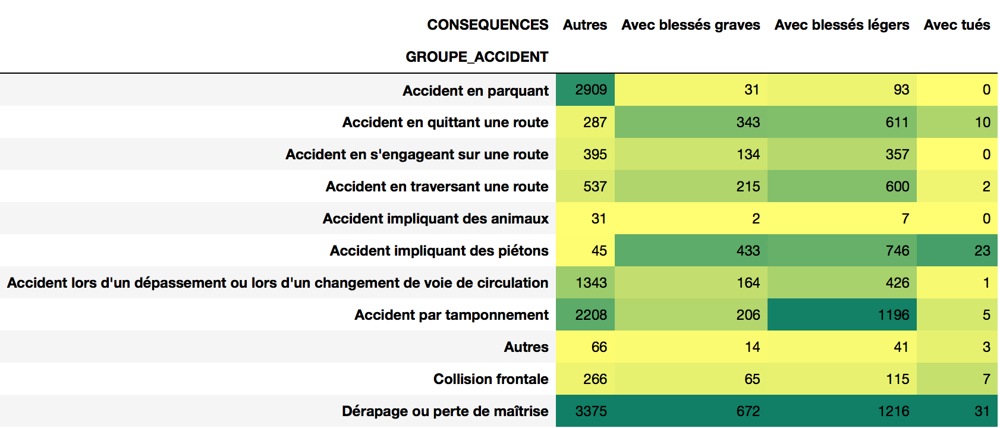

Road safety has always a been a first in the list matter for administration. An exploratory analysis has been done in order to understand better the accidents in Geneva. To get a general overview, we have asked ourselves the following questions:
* **When** are the accidents happen?

* **Where** are located?

* **How** they arise and why?

* **What** are the consequences of these accidents?

* **Who** are the people and vehicles involved?

## When?
ll the news evoque to an increase of accidents during last years. The evolution of number of accidents from 2010 to 2016 in Geneva shows that from 2012 to 2014 there has been a **strong increase**, however it has been stabilized during the last two years.

> ### In 2015, there were 66 accidents per week

The **months of the year with more accidents** are March, June, September and October. This coincide with the holidays start or the holidays ending. It can also be observed that in average, there are **more accidents at the end of the year**.

But when is the day of the week with more number of accidents in average? From Monday to Thursday we observe that there is the same amount of accidents in average.
> ### **Be careful** on Friday!

Is there the same risk during the morning and during the evening? It is known that the traffic is more dense in the morning or in the afternoon, when people go or come back home. We observe that it also correlated with the number of accidents.
> ### The time of the day you may be more aware is at 17h

## Where?
Where are the hot spots in geneva? 
add heatmap

## How and Why? 
Which are the group of accidents with more ocurrence? To focus our research, we will mainly focus on the three type of accidents with more ocurrence.
> ### Drift, Traffic jam collision and Parking accidents are the accident group with more ocurrence.

The number of accidents during the day is larger than during the night. However, the number of drifting accidents is nearly the same during the day than during the night.
> ### Please, _don't lose the attention_ and _moderate the speed_ during the night!

An accident can be classified as **Mortal, Severe, Mild and Unknown**. Let's check how the split is done comparing the accident group and the consequences:

* **Drifting accidents** and **accidents involving pedestrian** are **the most mortal**.
* **Traffic jam's collision accidents** and again, the **drifting accidents** are the ones with more severe consequenses.
* Tha amount of **accidents involving pedestrian** with severe consequences is considerable.

> ### From the conequences point of view, accidents involving pedestrians are also relevant

For Parking accidents, is difficult to define a cause of the accidents. This is why we will analyse it separately. Let's analyse then the three more important accidents to understand the main causes of them.

* **Drifting accidents** are mainly caused by the driver state or distraction. In addition, the speed is the third cause for this kind of accidents.
* One of the main causes of the accidents involving pedestrian is the pedestrian attitude itself. 
* For all the three accidents type, the driver or inattention of the driver is an important cause.

> The momentary innatention represents the 29% (40 accidents per month) of the total number of accidents of three main accident groups and the alcohol influence represents the 17% (23 accidents per month).

Has the number of accidents due to the alchool influence increased during the years?

## What?

How does the weather affect in type of accident 

## Who
