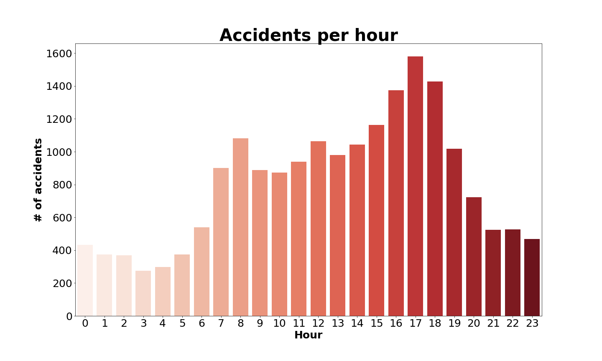

Road safety has always a been a first in the list matter for administration. An exploratory analysis has been done in order to understnad better the accidents in Geneva. A general approach to get an overview is two ask ourselves the following questions:
* **When** are the accidents happen?

* **Where** are located?

* **How** they arise and why?

* **What** are the consequences of these accidents?

* **Who** are the people and vehicles involved?

## When?

All the news evoque to an increase of accidents during last years. So we ask ourselves if they have really increased as the news says so? The evolution of number of accidents from 2010 to 2016 in Geneva shows that from 2012 to 2014 there has been a strong increase, however it has been stabilized during the last two years.
 

> ### In 2015, there were 66 accidents per week

The **months of the year with more accidents** are: March, June, September and October. This coincide with holidays start or holidays return. It also can be observed that in average, there are more accidents at the end of the year.

But when is the day of the week with more number of accidents in average? From Monday to Thursday we observe that there is the same amount of accidents in average.
> ### **Be careful** on Friday!

Is there the same risk during the morning than during the evening when we are tired? It is know that higher amount of traffic on the roads are during the morning or the afternoon, when people go or come back home. We observe that it also correlated with the number of accidents.
> ### The time of the day you may be more aware is at 17h

## Where?
Where are the hot spots in geneva? 
add heatmap

## Why? How?
Which are the group of accidents with more ocurrence? To focus our research, we will mainly focus on the three type of accidents with more ocurrence.
> ### Three main accident group: Drift, Traffic jam collision and Parking accidents

The number of accidents during the day is larger than during the night. However, the number of drifting accidents is nearly the same during the day than during the night.
> ### Please, _don't lose the attention_ and _moderate the speed_ during the night!

How does the weather affect in type of accident 
## What?
An accident can be classified as Mortal, Severe, Mild and Unknown. Let's check how the split is done comparing the accident group and the consequences:

* The **drifting accidents** and **accidents involving pedestrian** are **the most mortal**.
* The **traffic jam's collision accidents** and again, the **drifting accidents** are the ones with more severe consequenses.
* Tha amount of **accidents involving pedestrian** with severe consequences is considerable.

> ### From the conequences point of view, accidents involving pedestrians is also relevant

## Who
