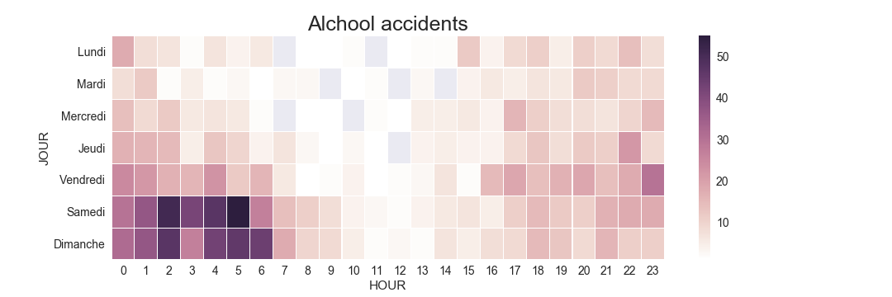



Welcome everybody! If you've already started playing with the map above, you probabily already understood much of how we decided to visualize our dataset. In this section we'll use these visualizations to guide you in the analysis and the understanding of the kind of accidents that usually happen in one of the most central and relevant parts of Genève: the famous Pont du Mont Blanc.

But first, let's spend a few words better describing our dataset. The dataset in our possess is a collection of 19930 accidents happened in the canton of Genève in between the years 2010 and 2016. Each data point represents an accident; each data point is geolocalized, and carachterized by features such as 
- cause of the accident
- time of the accident
- meteo conditions at the time of the accident

It's not a big dataset (less than 20K data points) with many categorical features, but still very complex to understand. It is indeed hard to find a single, efficient and intuitive way of visualizing such a complex, multi-dimensional and variously shaped dataset. While a choropleth map could be a possible option to visualize this dataset, we decided not to aggregate the data in such a way. Aggregating data in a choropleth map, even with really small regions, would have make the micro-patterns typical of this dataset disappear. Instead, by plotting each data point and letting the user the possibility to zoom and hover over points to get access to a small selection of meaningful raw data, we are able to almost fully exploit our data at every lenght scale: from the analysis of the accidents happened in a particular crossroad, to recognising big clusters of similar accidents of the scale of different blocks. 
Such a complete visualization is possible thanks to the relatively small size of our dataset. However, process and display all the dataset at once presents the considerable risk of overwhelm the reader of information, confusing him.

If you're ready, follow us in the exploration of this wonderful and interesting dataset!

# A first look at our data
Let's have a look at our data: first, let's just visualize our raw datapoints on a map: to avoid overplotting, we used the technique of "shading" our points: in this way, even if the points displayed overlap, it is still possible to distinguish the true shape of our dataset.



With this first visualization we can identify the roads and the blocks of Genève with the highest number of accidents in the last 6 years: it easy to recognize that the most accidents happen in the following blocks:
- close to the Railway station
- close to the main bridge of Geneve: Le Pont du Mont Blanc.

Aren't you curious to better understand the dynamics and the reasons of why so many accidents happen on such a particular location? Well, if you are, follow us in the (sad) story of the Pont du Mont Blanc.

Ready to start? Let's go!

# The (sad) story of Pont du Mont Blanc

Using the data from section 'Getting Started' we already know that more than 60% of the accidents in the canton of Geneve are caused by the following 3 categories of accidents:
- 'accidents par tamponament'
- 'accidents par derapage ou perte de maitrise'
- 'accident en parquant'
In the map hereunder we show only the accidents caused by these causes, plus the following category:
- 'accidents impliquant des pietons'
since as students without driving licences, we are personally interested in investigating also this category of accidents!



We already see different clusters of accidents in this map: while on the Pont du Mont Blanc the only cause responsible for accidents is 'accidents par tamponament', the crossroad just north of the bridge is heavily carachterized by 'accidents par derapage'. Let's now zoom and hover with the mouse on such accidents to get more data! If you do it, you'll discover that such accidents are:
- mainly caused by speed or alcool
- the accidents caused by alcool happened mainly during night time, especially during the weekend

Let's take a look at the following table then:

{: .align-center}

The fact that accidents caused by alcohol happen mostly at night-time is indeed well known; still it is interesting to see how this particular crossroad, in this particular location, is one of the places where such accidents happen!  
Let's continue our analysis in this direction: let's colour our datapoints according to the time:



- the accidents caused by alcool happened mainly during night time, especially during the weekend
We now have the visual confirmation that the accidents that happened in that crossroad north of the Pont du Mont Blanc happend mainly during night time; more in general, if we zoom out and we observe also the other crossroads, we can recognize that all the accidents happened during night-time in the center of Geneve are mailny concentrated on crossroads, and on main streets.

Let's now focus our attention to only one category of accidents: the accidents involving pedestrians.



Looking at this visualization, we see that on the Pont du Mont Blanc none of the accidents involved pedestrians: instead, this time our attention immediately falls on the north-west part of the map: there's an light, but unusual concentration of accidents involving pedestrians in that zone. With a simple zoom, we discover that the center of such distribution could be identified with the train station of Geneve. Again by hovering onto the points, we can see how most of the accidents close to the train station are actually not caused by the drivers, but by the pedestrians themselves, not paying attention, not respecting the traffic lights, and not using the pedestrian crossing, even if they are just 50 meters away. This is understandable if only we think to the usual chaos of pedestrians close to such an important train station; however, another suggestion to the institutions could be sensibilize more the pedestrians close to the train station, and maybe prioritize pedestrian traffic more with special lanes or, in a maybe too optimistic future, special overpasses, to eliminate the problem at the root.

# A more complete overview

Others interesting patterns all around this block of Genève could be caught by this visualization: dangerous turns, particularly dangerous crossroads, secondary roads with a lot of accidents involving pedestrians, and so on. In the following visualization provides you with a more complex, but yet not complete overview of the dataset. Experimenting with colours, subsets of the dataset and features, a lot of micro patterns appear, opening us the understanding of this complex dataset.
# Conclusions and further work
Similar analysis have proven to be extremely effective: in these example we were able to largely exploit the data in our possess to efficiently recognize patterns at different lenght-scales. Still, more interactive visualizations are possible: it could be possible to implement a slider to let the user visualize different years, or the difference between night time and day time, or switching between different days of the week, and so on! The number of possible combinations of paramenters and thus different visualizations is incredibly high! Now that we found the potential in this kind of visualization, it's just a matter of implementing such interactivity to have at our disposal a very powerful tool capable of providing us meaningful and precise insights of this dataset.
