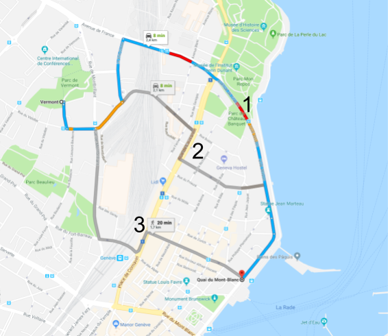

Never wanted to choose a route for it **safety** and not only for its rapidity? Or maybe you have children and you want them to take the **safest** route late at night? Those are the key concepts behind the risk calculator! We want **YOU** to **StaySafe!**.

This is more a proof of concept than a real tool (see limitations in the [Jupyter Notebook](https://www.google.ch/) associated). But here is an example, and you are welcome to play with the [Jupyter Notebook](https://www.google.ch/)

#### From Vermont to Quai du Mont-Blanc
If we want to go from Vermont to Quai du Mont-Blanc in Geneva, Google maps would give us three choices:  
_here results for the 16/12/2017, 17h30:_

{: .align-center70}

Where we have denoted the possibles routes from the fastest (1) to the slowest (2). But what about our safety? We just enter the coordinates of the origin and destination as Google has translated them i.e. ```origin=Vermont,+1202+Geneva``` and ```destination=Quai+du+Mont-Blanc,+1201+Genève``` and put them into the calculator to get:  

|            |    Route 1     |   Route 2     | Route 3        |
|:--:        | :---------:    |:-----:        | :-----:        |
| Total Risk | 5.948168       |   4.173144    |  3.719490      |

For this example, it turns out that the slowest road is computed as the safest!
As previously said, this is very uncertain, it advised to take a look to the [Jupyter Notebook](https://www.google.ch/)!

<hr>

#### Risk per road

One could also wonder what is the risk if we drive on a given road... Here you can search for it!

PUT TOOL HERE

Where the risk displayed is the risk if we 


<hr>
Non used table
|            | Route 1     |   Route 2  | Route 3   |
|:--:        | :---------: |:-----:     | :-----:   |
| Total Risk | 5.948168    |   4.173144 |  3.719490 |
| Mean Risk  | 1.982723 	  |2.086572 	  | 1.859745  |
| Roads      | 8           |11          |12         |
| Found Roads| 3           | 3          |2          |

<hr>


ll

LL 
<hr>


lalala
<hr>
| I am text to the left  |  |
<hr>
<p align="center">
[lala](../img/avatar-icon.png)
</p>

<hr>
width="460" height="300" new
<p align="center">

</p>
<hr>


Here are some trials, I hope you will enjoy them!
<hr>
preparation: 

 <link rel="stylesheet" href="https://unpkg.com/leaflet@1.2.0/dist/leaflet.css"
   integrity="sha512-M2wvCLH6DSRazYeZRIm1JnYyh22purTM+FDB5CsyxtQJYeKq83arPe5wgbNmcFXGqiSH2XR8dT/fJISVA1r/zQ=="
   crossorigin=""/>
   
 <!-- Make sure you put this AFTER Leaflet's CSS -->
 <script src="https://unpkg.com/leaflet@1.2.0/dist/leaflet.js"
   integrity="sha512-lInM/apFSqyy1o6s89K4iQUKg6ppXEgsVxT35HbzUupEVRh2Eu9Wdl4tHj7dZO0s1uvplcYGmt3498TtHq+log=="
   crossorigin=""></script>
   
 <div id="mapid"></div>
 
#mapid { height: 180px; }

var mymap = L.map('mapid').setView([51.505, -0.09], 13);

L.tileLayer('https://api.tiles.mapbox.com/v4/{id}/{z}/{x}/{y}.png?access_token={accessToken}', {
    attribution: 'Map data &copy; <a href="http://openstreetmap.org">OpenStreetMap</a> contributors, <a href="http://creativecommons.org/licenses/by-sa/2.0/">CC-BY-SA</a>, Imagery © <a href="http://mapbox.com">Mapbox</a>',
    maxZoom: 18,
    id: 'mapbox.streets',
    accessToken: 'your.mapbox.access.token'
}).addTo(mymap)

<hr>
<div class="chart"></div>
.chart div {
  font: 10px sans-serif;
  background-color: steelblue;
  text-align: right;
  padding: 3px;
  margin: 1px;
  color: white;
}
var data = [30, 86, 168, 281, 303, 365];

d3.select(".chart")
  .selectAll("div")
  .data(data)
    .enter()
    .append("div")
    .style("width", function(d) { return d + "px"; })
    .text(function(d) { return d; });


<hr>
<select id='race-10km' onchange="drawTimeWrtAge('10km');"></select>
<div id="timevsage-10km"></div>
