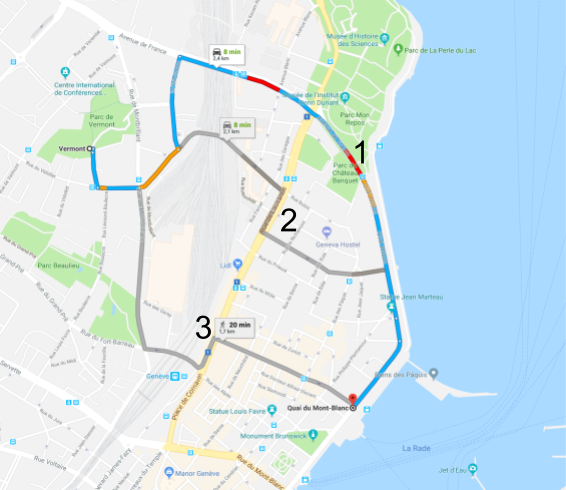

Never wanted to choose a route for it **safety** and not only for its rapidity? Or maybe you have children and you want them to take the **safest** route late at night? Those are the key concepts behind the risk calculator! We want **YOU** to **StaySafe!**.

This is more a proof of concept than a real tool (see limitations in the [Jupyter Notebook](https://www.google.ch/) associated). But here is an example, and you are welcome to play with the Jupyter Notebook above mentioned!

#### An example: from Vermont to Quai du Mont-Blanc
If we want to go from Vermont to Quai du Mont-Blanc in Geneva, Google maps would give us three choices:  
_here results for the 16/12/2017, 17h30:_

{: .align-center70}

Where we have denoted the possibles routes from the fastest (1) to the slowest (2). But what about our safety? We just enter the coordinates of the origin and destination as Google has translated them i.e. ```origin=Vermont,+1202+Geneva``` and ```destination=Quai+du+Mont-Blanc,+1201+Genève``` and put them into the calculator to get:  

|            |    Route 1     |   Route 2     | Route 3        |
|:--:        | :---------:    |:-----:        | :-----:        |
| Total Risk | 5.948168       |   4.173144    |  3.719490      |

For this example, it turns out that the slowest road is computed as the safest!
As previously said, this is very uncertain, it advised to take a look to the [Jupyter Notebook](https://www.google.ch/)!

<hr>


<hr>
Non used table

|            | Route 1     |   Route 2  | Route 3   |
|:--:        | :---------: |:-----:     | :-----:   |
| Total Risk | 5.948168    |   4.173144 |  3.719490 |
| Mean Risk  | 1.982723 	  |2.086572 	  | 1.859745  |
| Roads      | 8           |11          |12         |
| Found Roads| 3           | 3          |2          |

<hr>
